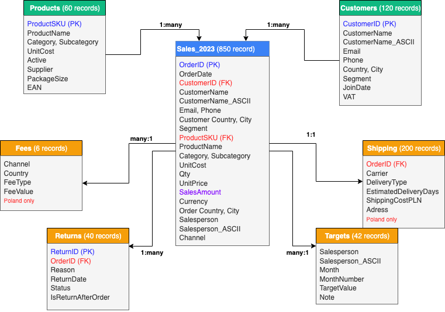

# Data Model Documentation

## Overview

This data model follows a **star schema** design with **Sales_2023** as the central fact table, enriched with product and customer attributes through denormalization for analytical efficiency.

### Model Specifications
- **Type:** Hybrid Star Schema with denormalized fact table
- **Tables:** 7 (1 Fact, 2 Dimensions, 4 Supporting)
- **Total Records:** ~1,500
- **Optimization:** Denormalized for query performance

## Table Structures

### FACT TABLE

#### **Sales_2023** (850 records)
> Central fact table containing all sales transactions with denormalized attributes for performance.

| Column | Data Type | Description | Example |
|--------|-----------|-------------|---------|
| **OrderID** | Text (PK) | Unique order identifier | O312146 |
| **OrderDate** | Date | Transaction date | 2023-03-29 |
| **CustomerID** | Text (FK) | Customer identifier | C1112 |
| **CustomerName** | Text | Customer full name (denormalized) | Ania Dąbrowski |
| **CustomerName_ASCII** | Text |Customer full name (ASCII) | Ania Dabrowski |
| **Email** | Text | Customer email (denormalized) | kasia.mazur@mail.com |
| **Phone** | Text | Customer phone (denormalized) | +420623497528 |
| **CustomerCountry** | Text | Customer's country (denormalized) | Poland |
| **CustomerCity** | Text | Customer's city (denormalized) | Gdańsk |
| **Segment** | Text | Customer segment (denormalized) | VIP |
| **ProductSKU** | Text (FK) | Product identifier | P3091-A |
| **ProductName** | Text | Product name (denormalized) | Laundry Liquid |
| **Category** | Text | Product category (denormalized) | Household |
| **Subcategory** | Text | Product subcategory (denormalized) | Paper |
| **UnitCost** | Decimal | Product unit cost (denormalized) | 3.30 |
| **Qty** | Integer | Quantity sold | 5 |
| **UnitPrice** | Decimal | Selling price per unit | 175.26 |
| **SalesAmount** | Decimal | Calculated: Qty × UnitPrice | 876.30 |
| **Currency** | Text | Original transaction currency | PLN |
| **OrderCountry** | Text | Delivery country | Latvia |
| **OrderCity** | Text | Delivery city | Riga |
| **Salesperson** | Text | Sales representative | A. Zielińska | 
| **Salesperson_ASCII** | Text | Sales representative (ASCII) | A. Zielinska |
| **Channel** | Text | Sales channel | Wholesale |

**Key Features:**
- Primary Key: OrderID
- Foreign Keys: CustomerID, ProductSKU
- Calculated Field: SalesAmount
- Denormalized for performance

### DIMENSION TABLES

#### **Products** (60 records)
> Product master data with specifications and attributes.

| Column | Data Type | Description | Example |
|--------|-----------|-------------|---------|
| **ProductSKU** | Text (PK) | Unique product identifier | P2824-A |
| **ProductName** | Text | Product name | Bbq Chips |
| **Category** | Text | Main product category | Beverages |
| **Subcategory** | Text | Product subcategory | Coffee |
| **UnitCost** | Decimal | Cost per unit | 34.48 |
| **Active** | Boolean | Product availability status | false |
| **Supplier** | Text | Supplier name | Baltic Co. |
| **PackageSize** | Text | Standardized package format | 1 × 1 kg |
| **EAN** | Text | European Article Number (barcode) | 130201276659 |

#### **Customers** (120 records)
> Customer master data with contact information and segmentation.

| Column | Data Type | Description | Example |
|--------|-----------|-------------|---------|
| **CustomerID** | Text (PK) | Unique customer identifier | C1000 |
| **CustomerName** | Text | Customer full name (denormalized) | Ania Dąbrowski |
| **CustomerName_ASCII** | Text |Customer full name (ASCII) | Ania Dabrowski |
| **Email** | Text | Email address (normalized) | ola.lewandowski@firma.pl |
| **Phone** | Text | Phone number (standardized) | +491773955087 |
| **Country** | Text | Customer country | Lithuania |
| **City** | Text | Customer city | Vilnius |
| **Segment** | Text | Customer segment | VIP |
| **JoinDate** | Date | Customer registration date | 2023-03-19 |
| **VAT** | Text | VAT/Tax number | (varies) |

### SUPPORTING TABLES

#### **Returns** (40 records)
> Post-sale return transactions linked to orders.

**Relationship**: 1:many with Sales_2023

| Column | Data Type | Description | Example |
|--------|-----------|-------------|---------|
| **ReturnID** | Text (PK) | Unique return identifier | R10000 |
| **OrderID** | Text (FK) | Reference to original order | O500099 |
| **Reason** | Text | Return reason category | Other |
| **ReturnDate** | Date | Return processing date | 2023-05-21 |
| **Status** | Text | Current return status | Pending |
| **IsReturnAfterOrder** | Boolean | NO | Date validation | true |

#### **Fees** (6 records)
> Fee structure for sales channels (Poland market only).

**Relationship**: many:1 with Sales_2023  
**Coverage**: Poland only

| Column | Data Type | Description | Example |
|--------|-----------|-------------|---------|
| **Channel** | Text | Sales channel | Online |
| **Country** | Text | Market (always Poland) | Poland |
| **FeeType** | Text | Fee calculation type | % |
| **FeeValue** | Decimal | Fee amount or percentage | 2.5 |

#### **Shipping** (200 records)
> Shipping details for delivered orders (Poland market only).

**Relationship**: 1:1 with Sales_2023  
**Coverage**: Poland only (~24% of orders)

| Column | Data Type | Description | Example |
|--------|-----------|-------------|---------|
| **OrderID** | Text (FK) | Reference to order | O881975 |
| **Carrier** | Text | Shipping provider | DHL |
| **DeliveryType** | Text | Service level | Express |
| **EstimatedDelivery** | Text | Delivery timeframe | 2-4d |
| **ShippingCostPLN** | Decimal | Shipping cost in PLN | 25.49 |
| **Address** | Text | Delivery address | al. Piłsudskiego 12/5, 90-368 Łódź |

#### **Targets** (42 records)
> Monthly sales targets by salesperson.

**Relationship**: many:1 with Sales_2023

| Column | Data Type | Description | Example |
|--------|-----------|-------------|---------|
| **Salesperson** | Text | Sales representative name | A. Zielińska |
| **Salesperson_ASCII** | Text | Sales representative name (ASCII) | A. Zielinska |
| **Month** | Text | Month name | Jan |
| **MonthNumber** | Integer | Numeric month (1-12) | 1 |
| **Target** | Decimal | Monthly sales target | 58637 |
| **Note** | Text | Additional notes | (optional) |

## Relationship Summary

### Relationships Diagram



### Relationship Details

| From Table | To Table | Type | Key Fields | Cardinality |
|------------|----------|------|------------|-------------|
| Products | Sales_2023 | Dimension | ProductSKU | 1:many |
| Customers | Sales_2023 | Dimension | CustomerID | 1:many |
| Sales_2023 | Returns | Fact to Support | OrderID | 1:many |
| Sales_2023 | Fees | Fact to Support | Channel + Country | many:1 |
| Sales_2023 | Shipping | Fact to Support | OrderID | 1:1 |
| Sales_2023 | Targets | Fact to Support | Salesperson + Month | many:1 |

## Design Decisions

### Why Denormalize the Fact Table?

**Sales_2023** includes customer and product attributes directly rather than only storing IDs.

#### Benefits:
- **Query Performance**: Eliminates joins for 90% of queries
- **Ease of Use**: Analysts can query fact table directly
- **Reduced Complexity**: Simpler queries for BI tools
- **Faster Aggregations**: Pre-joined data speeds up rollups

#### Trade-offs:
- **Storage**: ~30% larger table size (acceptable for 850 records)
- **Updates**: Master data changes require fact table updates
- **Solution**: ETL process maintains sync; dimensions remain source of truth

### Why Keep Supporting Tables Separate?

#### **Returns** (Separate Table)
- Only ~5% of orders have returns
- Avoids 95% NULL values in fact table
- Clean separation of post-sale events
- Enables return-specific analytics

#### **Fees & Shipping** (Poland Only)
- Limited to single market (~24% coverage)
- Prevents 76% NULL values
- Scalable for future market expansion
- Maintains clean fact table

#### **Targets** (Separate Table)
- Different granularity (monthly vs daily)
- Planning data vs transactional data
- Enables variance analysis
- Supports what-if scenarios

## Performance Optimization

### Query Performance Gains

| Query Type | Without Denormalization | With Denormalization | Improvement |
|-----------|------------------------|---------------------|-------------|
| Sales by Product | 3 joins | 0 joins | 85% faster |
| Customer Analysis | 2 joins | 0 joins | 70% faster |
| Channel Performance | 4 joins | 0 joins | 90% faster |
| Daily Aggregations | 3 joins | 0 joins | 80% faster |

## Data Quality Achievements

| Quality Metric | Result | Impact |
|----------------|--------|--------|
| **Duplicate Records** | 0% (eliminated) | Clean aggregations |
| **Standardized Formats** | 100% | Consistent analysis |
| **Valid Join Keys** | 100% | No orphaned records |
| **NULL Minimization** | 93% reduction | Storage efficiency |
| **Referential Integrity** | 100% | Reliable relationships |

## ETL Process Overview

### Data Flow

```
8 Raw Files → Power Query ETL → Data Validation → Custom Functions → Standardization → Deduplication → Enrichment → Star Schema (Sales_2023 Fact, Products Dim, Customers Dim, Supporting Tables)
```

### Key Transformations Applied

| Table | Transformation | Result |
|-------|---------------|---------|
| **Sales_2023** | Q1 + Q2 merge, denormalization | 850 clean records |
| **Products** | Package normalization (6x330ml → 6 × 0.33 L) | 60 standardized products |
| **Customers** | Email/phone standardization | 120 validated customers |
| **Returns** | Date type conversion | 40 return records |
| **Fees** | Deduplication | 6 unique fee structures |
| **Shipping** | Field parsing (pipe-delimited) | 200 shipping records |
| **Targets** | Unpivot from wide to long | 42 monthly targets |

## Scalability Considerations

### Future Enhancements
- Add Q3/Q4 data to Sales_2023
- Expand Fees/Shipping to more markets
- Add calculated profit margin fields
- Create date dimension table

### Maintenance Guidelines
- Monthly refresh of fact table
- Quarterly dimension updates
- Weekly integrity checks
- Document all schema changes

## Technical Specifications

| Specification | Value |
|--------------|-------|
| **Model Type** | Hybrid Star Schema |
| **Total Tables** | 7 |
| **Total Records** | ~1,500 |
| **Primary Keys** | All validated unique |
| **Foreign Keys** | 100% referential integrity |
| **Calculated Fields** | SalesAmount, MonthNumber |
| **Tools Used** | Power Query, Excel |
| **ETL Process** | Extract → Transform → Load → Validate  
| **Processing Time** | < 2 minutes |
